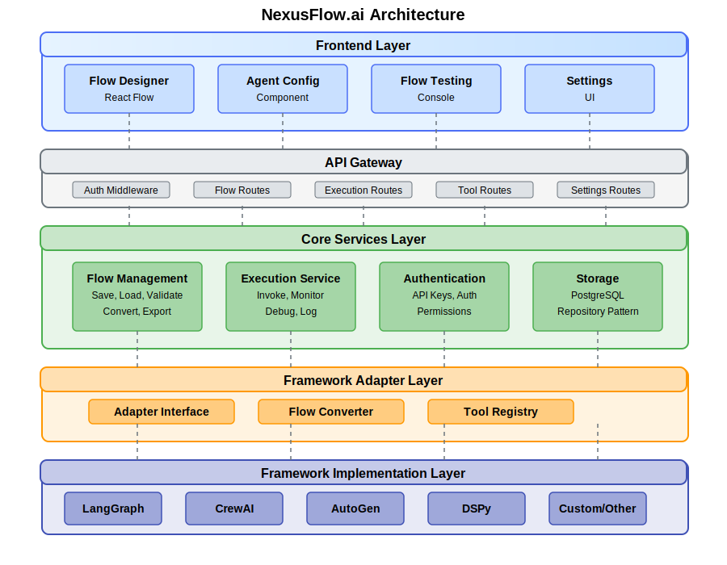
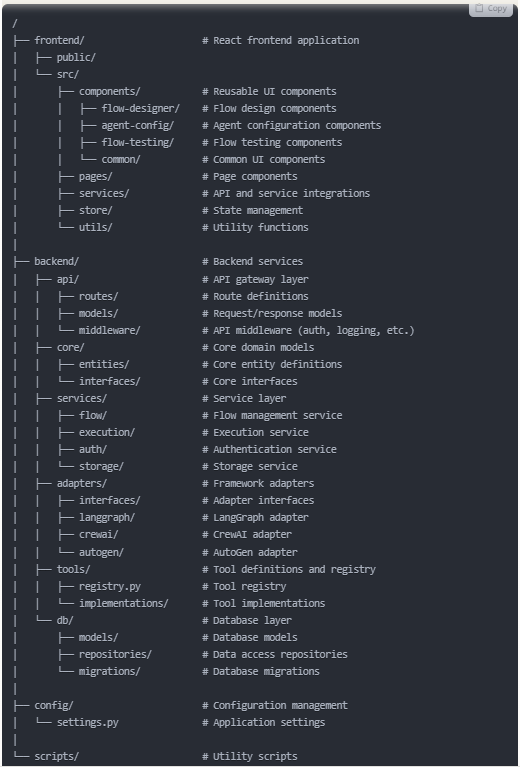

# NexusFlow.ai

NexusFlow.ai has great potential to be extended into a more comprehensive agentic AI flow tool. Let me outline a folder and file structure that leverages your existing code while supporting the new architecture.

**Reusable Components**

**Frontend**

Most of your existing UI code is very usable and aligns well with the architecture diagram:

Flow Designer: Your existing FlowBuilder.jsx, FlowEditor.jsx, and related components can form the core of this module
Agent Config Component: AgentConfigEditor.jsx and NodePropertiesPanel.jsx provide a solid foundation
Flow Testing Console: FlowTestConsole.jsx can be used as-is with minor modifications
Settings: Your existing settings page can be extended

**Backend**

On the backend side, these components can be retained and extended:

Core Agent System: Your agent, capability, and flow implementations provide a solid core
API Routes: The existing FastAPI routes provide good RESTful patterns
Database Models: Your existing models are well-designed for the PostgreSQL database

**Proposed Folder Structure**

/   
├── frontend/                     # React frontend application  
│   ├── public/  
│   └── src/  
│       ├── components/           # Reusable UI components  
│       │   ├── flow-designer/    # Flow design components  
│       │   ├── agent-config/     # Agent configuration components  
│       │   ├── flow-testing/     # Flow testing components  
│       │   └── common/           # Common UI components  
│       ├── pages/                # Page components  
│       ├── services/             # API and service integrations  
│       ├── store/                # State management  
│       └── utils/                # Utility functions  
│   
├── backend/                      # Backend services  
│   ├── api/                      # API gateway layer  
│   │   ├── routes/               # Route definitions  
│   │   ├── models/               # Request/response models  
│   │   └── middleware/           # API middleware (auth, logging, etc.)  
│   ├── core/                     # Core domain models  
│   │   ├── entities/             # Core entity definitions  
│   │   └── interfaces/           # Core interfaces  
│   ├── services/                 # Service layer  
│   │   ├── flow/                 # Flow management service  
│   │   ├── execution/            # Execution service  
│   │   ├── auth/                 # Authentication service  
│   │   └── storage/              # Storage service  
│   ├── adapters/                 # Framework adapters  
│   │   ├── interfaces/           # Adapter interfaces  
│   │   ├── langgraph/            # LangGraph adapter  
│   │   ├── crewai/               # CrewAI adapter  
│   │   └── autogen/              # AutoGen adapter  
│   ├── tools/                    # Tool definitions and registry  
│   │   ├── registry.py           # Tool registry  
│   │   └── implementations/      # Tool implementations  
│   └── db/                       # Database layer   
│       ├── models/               # Database models  
│       ├── repositories/         # Data access repositories  
│       └── migrations/           # Database migrations  
│   
├── config/                       # Configuration management  
│   └── settings.py               # Application settings  
│  
└── scripts/                      # Utility scripts  

**Implementation Strategy**  
**1. Framework Adapter Layer**  
This is the key addition needed to support multiple frameworks:  

Create an adapter_interface.py that defines common methods for all frameworks:

convert_flow(nexusflow_flow) -> framework_flow
execute_flow(framework_flow, input_data) -> execution_result
register_tools(tools) -> framework_tools

Implement adapters for each framework (LangGraph, CrewAI, AutoGen, etc.)

**2. Core Services Layer**
Enhance your existing code with dedicated services:

Flow Management Service: Build on your existing Flow class
Execution Service: Extend your execution functionality
Authentication Service: Add proper authentication for multi-user support

**3. Frontend Enhancements**
Your existing frontend code is quite capable, but needs these additions:

Framework selection dropdown in Flow Designer
Framework-specific configuration options
Enhanced visualization for different framework execution patterns

**4. Storage Service**
Implement proper storage service for:

Flow definitions
Execution histories
Agent configurations
Tool configurations

**What Can Stay Almost As-Is**

Agent Implementation: Your agent system is well-designed
Capability Registry: The capability system can be retained
API Structure: Your FastAPI implementation is solid
UI Components: Most React components can be reused
Database Models: Your existing models work well

**What Needs Significant Changes**

Flow Execution Engine: Needs to delegate to framework adapters
Tool Registry: Needs to map to framework-specific tool formats
Authentication: Needs to be implemented for multi-user support
Deployment: Needs to handle framework-specific deployment requirements

This structure maintains backward compatibility with your existing codebase while laying the foundation for the multi-framework support and enhanced features you're looking to implement. The adapter pattern will be crucial for integrating with various frameworks without changing your core business logic.

**Updated Architecture**
Your original architecture diagram is solid and works well as a conceptual foundation. Here's how I'd refine it slightly:

The key change in this refined architecture is the addition of an API Gateway layer between the Frontend and Core Services, which will handle authentication, request validation, and routing.

**Files to Delete**

Since you're open to significant changes, here's a categorization of your existing files:
Files to Keep (with modifications)

Most frontend UI components (with updated API integrations)
Database models and session management
Core agent data structures

**Files to Delete or Completely Rewrite**

nexusflow/core/flow.py - Replace with adapter-based implementation  
nexusflow/core/node.py - Replace with framework-specific implementations  
nexusflow/graph/ directory - Replace with adapter-based implementations  
nexusflow/api/routes.py - Rewrite to work with new service layer  
nexusflow/api/server.py - Replace with a more configurable API gateway  
nexusflow/llm/ directory - Replace with a more modular provider system  

**Files to Add**

New adapter interfaces and implementations
Service-layer implementations
Framework-specific converters
Tool registry with framework mappings

**New Folder Structure**   
  

**Implementation Guidelines**   
**1. Framework Adapter Layer**   
The adapter layer should be completely rewritten 

**2. Service Layer**  
The service layer should be completely new:  

**3. API Gateway**  
Create a new API gateway   

NexusFlow.ai - Clean Architecture Approach
Based on your requirement for a complete rebuild without backward compatibility concerns, here's the proposed structure for your agentic AI flow orchestration platform.

**Core Components**  
1. Frontend Layer  
The UI will be built using React with key components:

Flow Designer: Visual editor using React Flow for designing agent workflows
Agent Configuration: Component for setting up agents and their capabilities
Flow Testing Console: Real-time testing environment for flows
Settings: UI for configuring platform settings

2. API Gateway Layer  
This layer handles all client-server communication:

Authentication and authorization middleware
Request validation and routing
Versioning and API documentation

3. Core Services Layer  
The business logic resides here:

Flow Management Service: Create, read, update, delete, validate, and convert flows
Execution Service: Execute flows, monitor performance, debug issues, log results
Authentication Service: Manage API keys, authentication, and permissions
Storage Service: Database operations via repository pattern

4. Framework Adapter Layer  
This is the crucial layer that enables multi-framework support:

Adapter Interface: Common interface for all framework adapters
Flow Converter: Transforms NexusFlow's internal format to framework-specific flows
Tool Registry: Maps NexusFlow tools to framework-specific tools

5. Framework Implementation Layer  
The concrete implementations for each supported framework:

LangGraph Adapter: Implementation for LangGraph
CrewAI Adapter: Implementation for CrewAI
AutoGen Adapter: Implementation for AutoGen
DSPy Adapter: Implementation for DSPy
Custom/Other: Support for additional frameworks

Files to Delete from Current Codebase
Since we're doing a complete rebuild, you should delete most of the current implementation code but keep the UI components that can be repurposed:

Delete all backend execution logic:

Delete /nexusflow/core/flow.py
Delete /nexusflow/core/node.py
Delete entire /nexusflow/graph/ directory

Delete current API implementation:

Delete /nexusflow/api/routes.py
Delete /nexusflow/api/server.py

Delete LLM provider implementation:

Delete entire /nexusflow/llm/ directory

Keep and adapt these UI components:

Keep ui/src/components/FlowBuilder.jsx
Keep ui/src/components/AgentConfigEditor.jsx
Keep ui/src/components/FlowTestConsole.jsx
Keep ui/src/components/NodePropertiesPanel.jsx

By implementing this architecture, you'll create a flexible platform that can support multiple agent orchestration frameworks while providing a unified interface for users to create, test, and deploy flows.

Getting Started with the NexusFlow.ai Implementation
Now that you've cleaned up the repository, let's start building your multi-framework agent orchestration platform. Here's a step-by-step approach to kickstart the development:
Step 1: Set Up Project Structure
First, create the directory structure for your new architecture:

# Create backend directories
mkdir -p backend/api/{routes,models,middleware}
mkdir -p backend/core/{entities,interfaces}
mkdir -p backend/services/{flow,execution,auth,storage}
mkdir -p backend/adapters/{interfaces,langgraph,crewai,autogen}
mkdir -p backend/tools/implementations
mkdir -p backend/db/{models,repositories,migrations}
mkdir -p config

# Create frontend directories (if not already exists)
mkdir -p frontend/src/{components,pages,services,store,utils}
mkdir -p frontend/src/components/{flow-designer,agent-config,flow-testing,common}

Step 2: Set Up Backend Core  
Start by implementing the core interfaces that will define your system:  

Create the framework adapter interface:  
# backend/adapters/interfaces/base_adapter.py  

Create the flow entity model:
# backend/core/entities/flow.py  

Step 3: Implement Database Models  
Set up the database models for PostgreSQL:
# backend/db/models/flow_model.py

Step 4: Create Repository Layer  
Implement the repository pattern for data access:
# backend/db/repositories/flow_repository.py

Step 5: Implement Services  
Create the flow service as a core business logic component:
# backend/services/flow/flow_service.py

Step 6: Implement a Framework Adapter  
Let's create a LangGraph adapter as an example:
# backend/adapters/langgraph/langgraph_adapter.py

Step 7: Create API Routes  
Set up the FastAPI routes for your API:
# backend/api/routes/flow_routes.py  

Step 8: Create FastAPI App  
Set up the main FastAPI application:
# backend/api/app.py  

Step 9: Set Up the Frontend  
Reuse your existing UI components but update the API integration:

Update the API service:  
Update the Flow Designer component to include framework selection.

Step 10: Run the Development Environment  
Create scripts to start development servers:
For the frontend, update your package.json to point to the new backend.

**Next Steps**  

Complete the missing API routes: Implement the execution and tool routes  
Add authentication: Implement API key authentication  
Implement additional adapters: Create adapters for CrewAI, AutoGen, etc.  
Enhance the UI: Update UI components to support framework selection  
Develop testing tools: Add integration tests for adapters  

By following these steps, you'll have a solid foundation for your multi-framework agent orchestration platform. The adapter pattern allows you to seamlessly support different frameworks while maintaining a consistent API.

